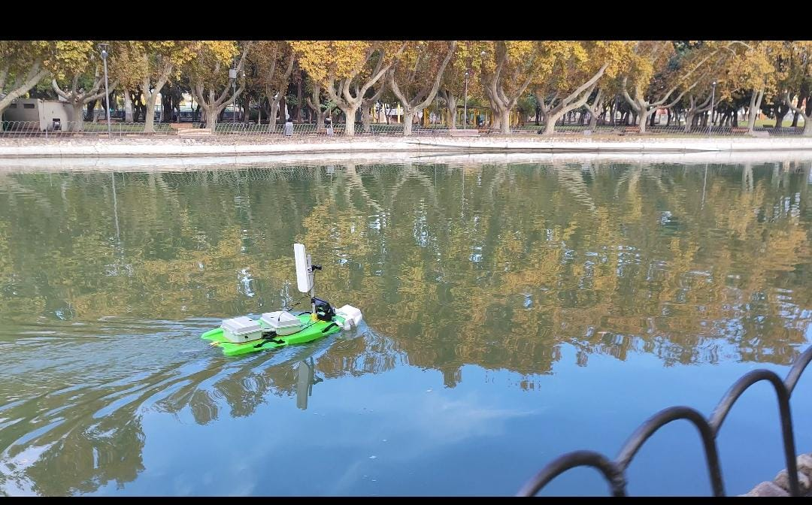
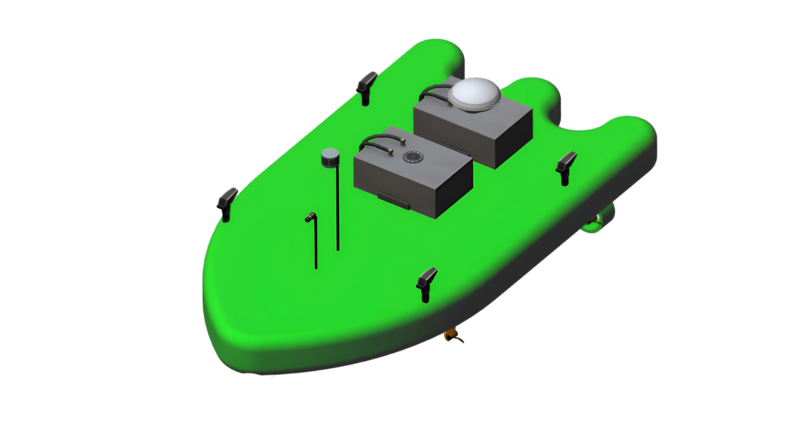
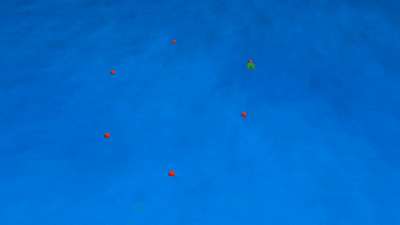

# IAcquaBot Sim

**IAcquaBot Sim** is an open-access simulation platform for surface robotic vehicles.  
It enables researchers and engineers to develop, test, and validate motion control strategies  
under realistic marine conditions using a customizable USV model and sensor suite.

This repository is a **fork of [Virtual RobotX (VRX)](https://github.com/osrf/vrx)**,  
extended with a new monohull surface vehicle inspired by **IAcquaBot**, a real-world robot  
developed at the **National University of San Juan (Argentina)**.

<p align="center">
  
  
</p>
---

## Features

- Fully integrated with **Gazebo Classic**, based on the VRX simulation environment  
- Monohull USV with **4 differential thrusters** 
- Multiple configurable **simulation scenarios** (harbor, open sea, beach, etc.)
- Environmental **disturbances** including **waves** and **wind**
- Includes onboard sensors:
  - **GPS**
  - **IMU**
  - **LiDAR**
  - **Camera**
  - **Echosounder**
  - **Pinger Receiver**
<p align="center">
  
</p>
---
## Controllers

The simulation framework includes a set of model-based motion controllers  
implemented using an identified dynamic model of the vehicle.  
The model structure follows a standard 3-DOF surface vessel formulation  
as proposed by Fossen for marine vehicle dynamics.

Available controllers include:

- **Velocity Controller**: Regulates surge and yaw velocities via low-level feedback.  
- **Point-to-Point Navigation**: Drives the vehicle to discrete goal positions using kinematic guidance.  
- **Path Following Controller**: Tracks geometric paths defined in Cartesian space.  
- **Trajectory Tracking Controller**: Follows time-parametrized reference trajectories with full-state feedback.

<p align="center">
  
  
  
</p>

## Citation

If you use **IAcquaBot Sim** in your work, please cite our associated paper:

> **B. Saldarriaga, J. Varela-Aldás, F. Roberti, J. M. Toibero**  
> *Open-Access Simulation Platform and Motion Control Design for a Surface Robotic Vehicle in the VRX Environment*

You should also cite the original VRX project:

```bibtex
@InProceedings{bingham19toward,
  Title                    = {Toward Maritime Robotic Simulation in Gazebo},
  Author                   = {Brian Bingham and Carlos Aguero and Michael McCarrin and Joseph Klamo and Joshua Malia and Kevin Allen and Tyler Lum and Marshall Rawson and Rumman Waqar},
  Booktitle                = {Proceedings of MTS/IEEE OCEANS Conference},
  Year                     = {2019},
  Address                  = {Seattle, WA},
  Month                    = {October}
}
```

## Contact

If you have questions or want to contribute, feel free to open an issue or pull request.  
For academic inquiries, contact **Brayan Saldarriaga** via email bsaldarriaga@inaut.unsj.edu.ar